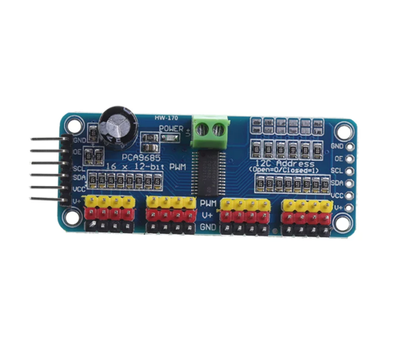
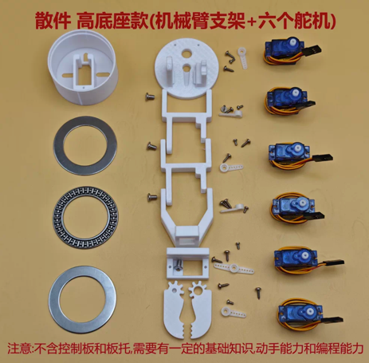
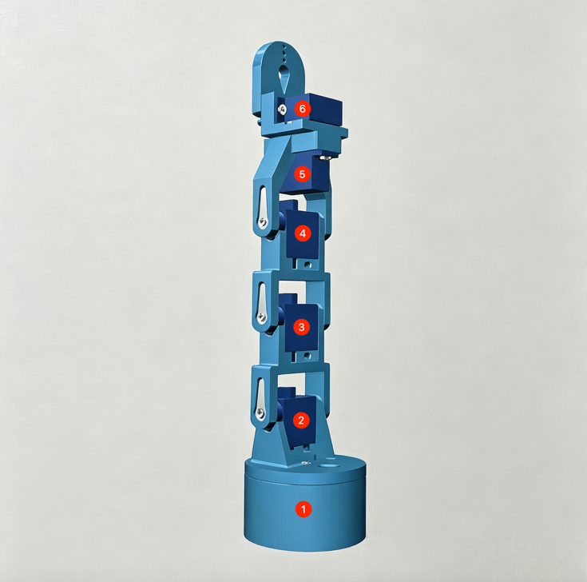
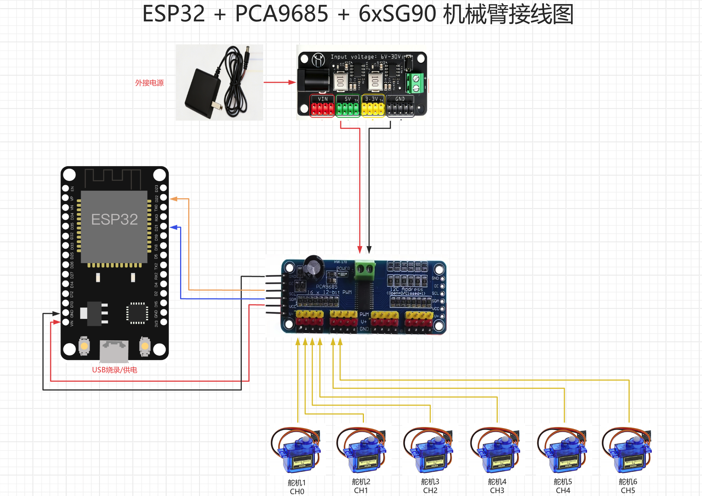
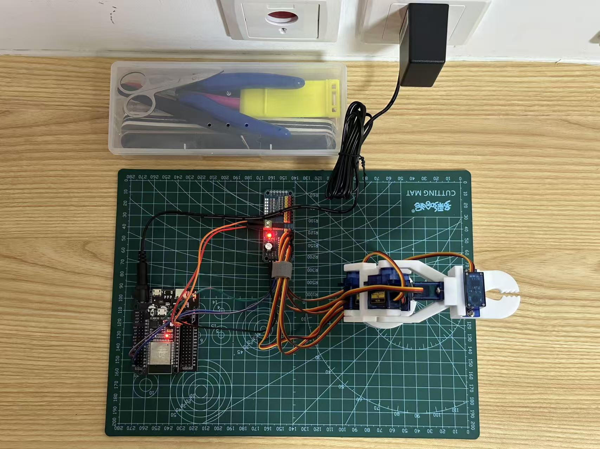
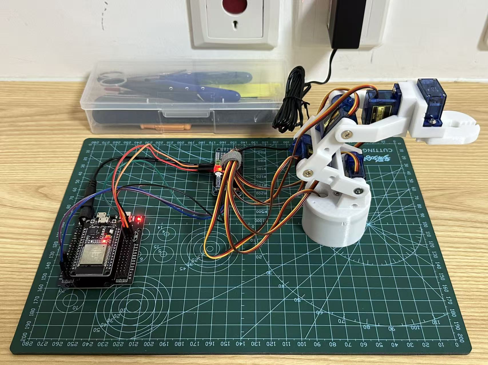

# ESP32 + MicroPython 通过 WiFi 网页控制 6 轴 5 自由度机械臂

## 硬件清单

| 配件 | 购买 | 参考图 |
|------|------|--------|
| ESP32 开发板 | [链接](https://e.tb.cn/h.8QnrIjBGCaL87kO?tk=NwqlT2GwiDR) |  |
| PCA9685 舵机驱动板 | [链接](https://e.tb.cn/h.89sTBkGuRaInmTD?tk=X1lFT2GFTRu) |  |
| 机械臂支架 + 6 个 SG90 舵机 | [链接](https://e.tb.cn/h.8jn1UDyRoXPFLdN?tk=ZdosT2tV1S7) |  |
| 5V 电源 + 杜邦线 | [链接](https://e.tb.cn/h.8jMGqH3UVVq74ua?tk=vhmkT2ua5qC) |  |

## 环境搭建

[ESP32+Thonny+MicroPython环境搭建](ESP32+Thonny+MicroPython环境搭建.md)

## 快速开始

### 1. 机械臂组装

按照淘宝商家说明组装即可。

### 2. 接线图

器件：ESP32、PCA9685、6 个 SG90、外部 5V 电源（建议 ≥3A）。

**ESP32 ↔ PCA9685（I2C 逻辑）**

| ESP32 | PCA9685 | 说明 |
|--------|----------|------|
| 5V | VCC | 逻辑供电 |
| GND | GND | 共地 |
| GPIO21 | SDA | I2C 数据 |
| GPIO22 | SCL | I2C 时钟 |

地址默认 `0x40`，OE 不接。

**外部 5V ↔ PCA9685（舵机动力）**

| 电源 | PCA9685 |
|------|----------|
| 5V+ | V+（接线柱 +） |
| GND | GND（接线柱 −） |

**PCA9685 ↔ 舵机（CH0～CH5）**

每个通道 3 针，从内到外一般是：PWM / V+ / GND。

| 舵机线 | 接到 |
|--------|------|
| 黄/橙（信号） | PWM（黄针） |
| 红（电源） | V+（红针） |
| 棕/黑（地） | GND（黑针） |

| 通道 | 舵机 |
|------|------|
| CH0 | 舵机 1 |
| CH1 | 舵机 2 |
| CH2 | 舵机 3 |
| CH3 | 舵机 4 |
| CH4 | 舵机 5 |
| CH5 | 舵机 6 |

先接好外部 5V 给 PCA9685，再给 ESP32 上电。舵机线别插反：信号对黄针，棕色对黑针。

### 3. 上传程序

- 在 `main.py` 顶部填写 `WIFI_SSID` / `WIFI_PASSWORD`
- 用 Thonny 将 `main.py` 保存到 ESP32 根目录（开机自启）
- 串口会打印 IP，浏览器访问 `http://ESP32的IP/`
- 代码地址 [https://github.com/zlei9607/esp32/tree/main/arm](https://github.com/zlei9607/esp32/tree/main/arm)

### 4. 访问网页，运行测试

