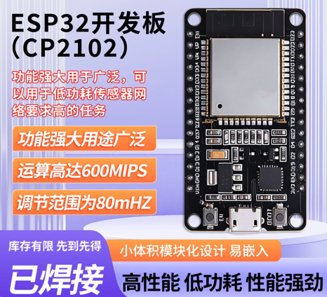
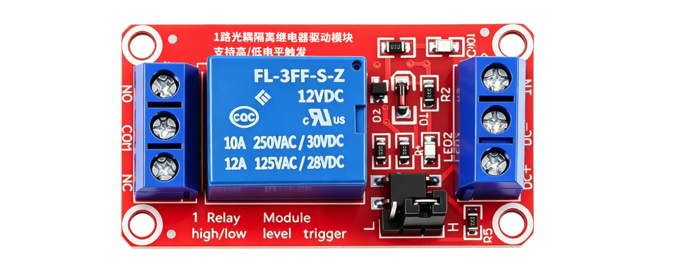
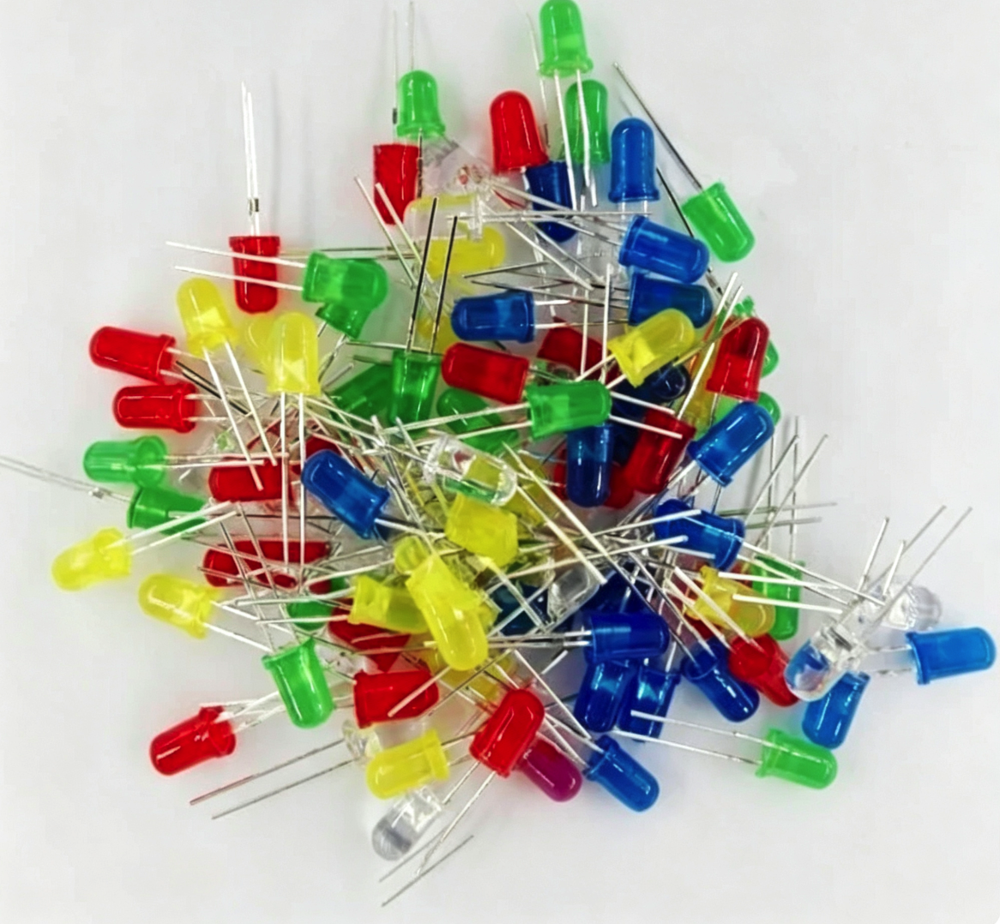
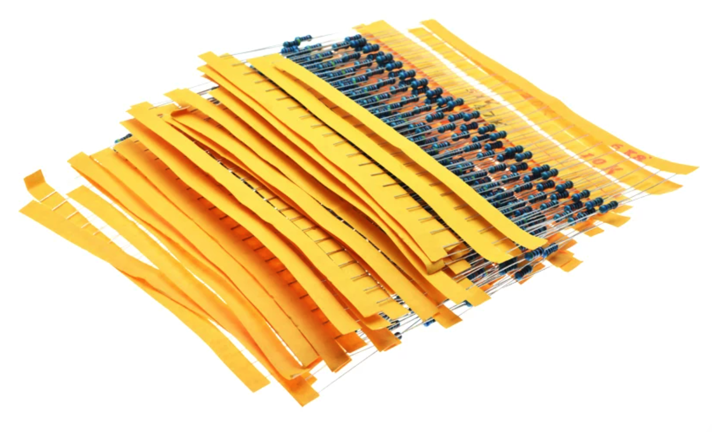
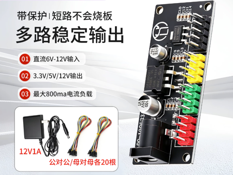
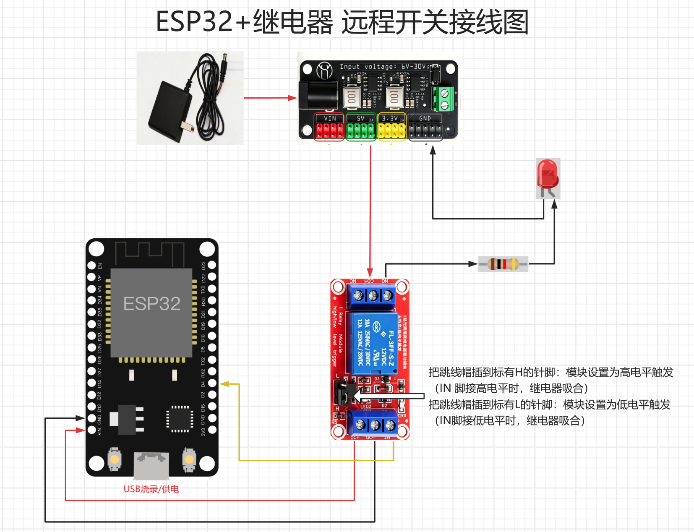
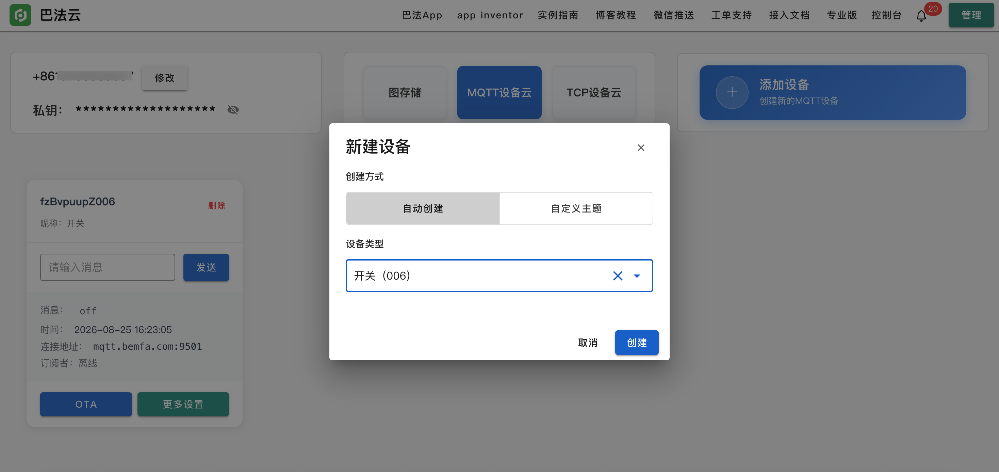
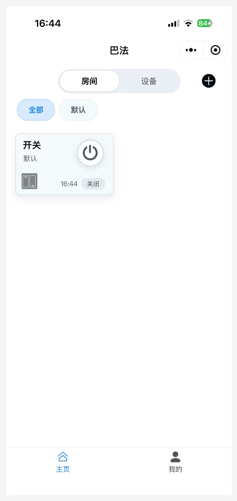

# ESP32 通过巴法云 MQTT 控制继电器，微信「巴法云」小程序远程开关

## 硬件清单

| 配件        | 购买 | 参考图                                                                     |
|-----------|------|-------------------------------------------------------------------------|
| ESP32 开发板 | [链接](https://e.tb.cn/h.8QnrIjBGCaL87kO?tk=NwqlT2GwiDR) |   |
| 继电器       | [链接](https://e.tb.cn/h.8lIGuOTV4FPgMWD?tk=dVonTWiJdj5) |   |
| LED灯      | [链接](https://e.tb.cn/h.8lIpkKmsfEYwvZx?tk=6t0uTWilKTg) |   |
| 220欧电阻    | [链接](https://e.tb.cn/h.8kXscWcM8sHhxPO?tk=bvvXTWimWnT) | ! |
| 5V 电源 + 杜邦线 | [链接](https://e.tb.cn/h.8jMGqH3UVVq74ua?tk=vhmkT2ua5qC) |   |

## 环境搭建

[ESP32+Thonny+MicroPython环境搭建](ESP32+Thonny+MicroPython环境搭建.md)

## 快速开始

### 1. 接线图

这里用 **5V 电源 + LED** 模拟 **市电火线/零线 + 灯泡**。



**控制端（ESP32 ↔ 继电器模块）**

| ESP32 | 继电器模块 | 说明 |
|-------|------------|------|
| 5V | VCC | 模块供电 |
| GND | GND | 共地 |
| GPIO4 | IN | 控制信号 |

**负载端（LED 模拟市电灯**

用5V / VCC 模拟火线、GND 模拟零线、LED 模拟灯泡：

| 本例接线 | 对应市电 |
|----------|----------|
| **5V** → 继电器 **COM** | 火线 → COM |
| 继电器 **NO** → 220Ω → LED 正极 | NO → 灯 |
| LED 负极 → **GND** | 灯另一端 → 零线 |

吸合时：`5V(火线) → COM → NO → 电阻 → LED → GND(零线)`，LED 点亮。

> 真机控灯同此：火线进 **COM**，**NO** 接灯，灯另一端接零线。**务必断电接线，注意绝缘与安全**。低电平触发的模块可能与本例电平逻辑相反，以模块丝印为准。

### 2. 注册巴法云

- 打开 [https://cloud.bemfa.com](https://cloud.bemfa.com) 注册并登录
- 进入 **控制台**，复制 **私钥**（一长串 32 位字符）
- 进入 **MQTT 设备云**，**新建设备**，选择设备类型，创建后复制主题名

  

### 3. 上传程序

- 编辑 `main.py`，填写以下信息

   ```
   WIFI_SSID = "你的WiFi"
   WIFI_PWD = "你的密码"
   BEMFA_UID = "控制台复制的私钥"
   TOPIC = "与控制台创建的主题名一致"
   ```
- 用 Thonny 上传到 ESP32 根目录为 `main.py`
- 代码地址 [https://github.com/zlei9607/esp32/tree/main/bemfa](https://github.com/zlei9607/esp32/tree/main/bemfa)


### 4. 微信小程序控制

- 微信搜索 **「巴法云」** 小程序
- 登录同一账号
- 界面上会出现开关按钮，点 **开/关** 即可

  

  小程序发 `on` / `off`，ESP32 收到后控制 GPIO4 继电器。

